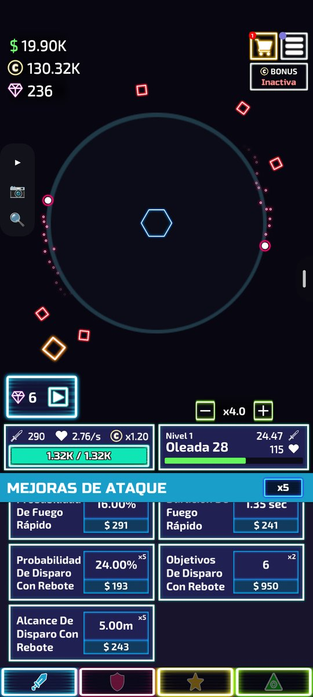
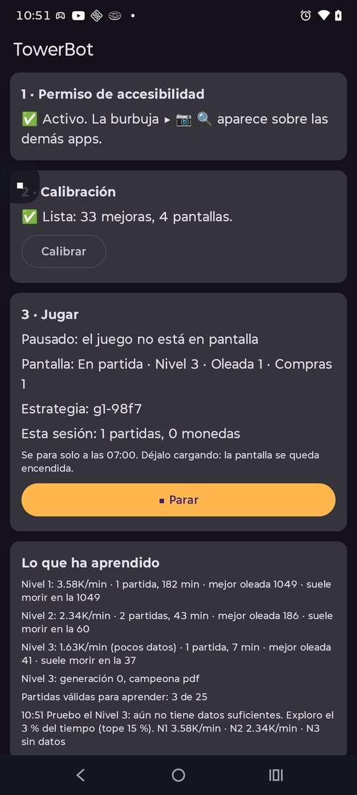
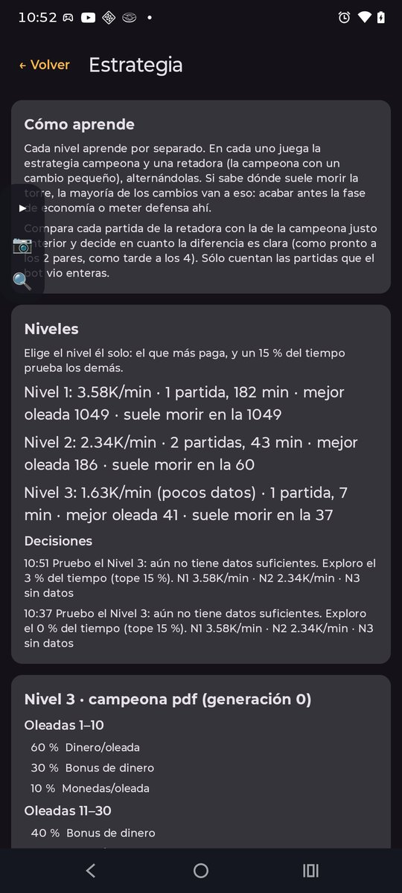
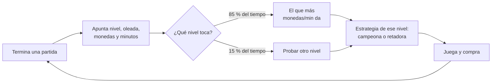
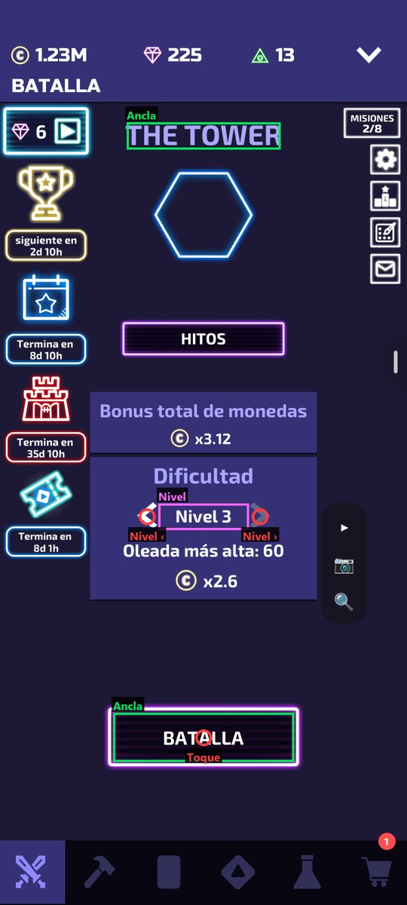
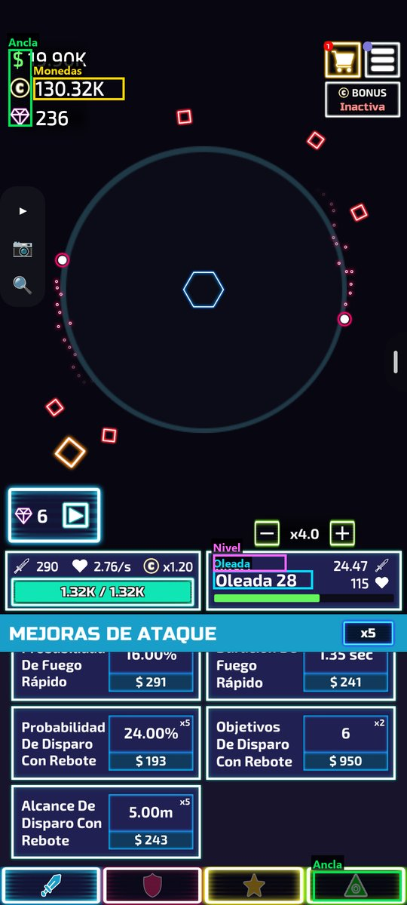
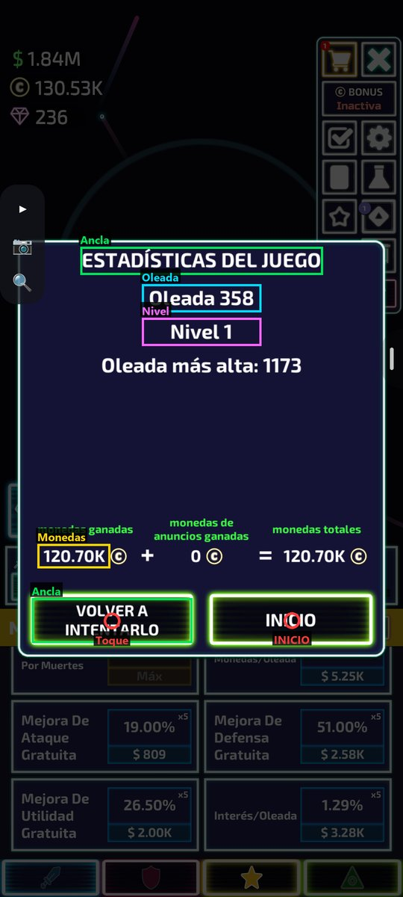
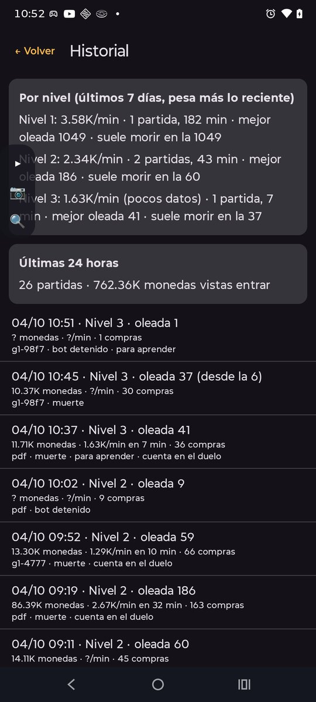
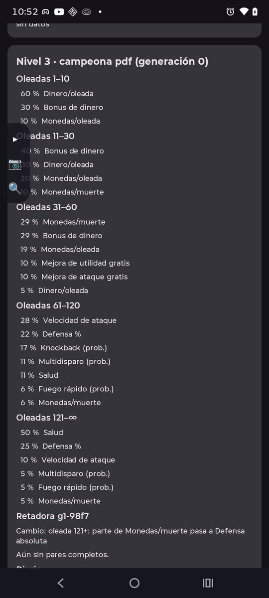
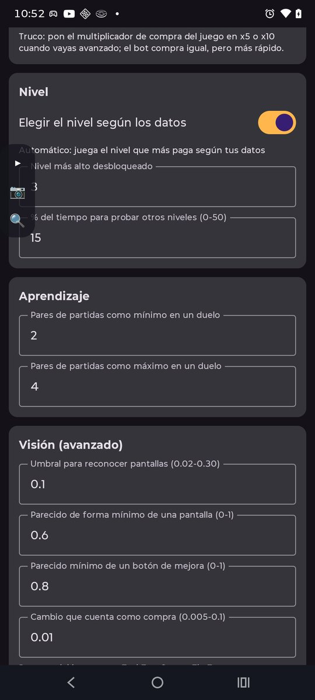

# TowerBot

App Android que juega a **The Tower – Idle Tower Defense** mientras duermes. Empieza
partidas, compra mejoras con el dinero de la partida, al morir vuelve a empezar y apunta lo
que gana cada partida. Con esos datos decide **en qué nivel jugar** y **qué comprar**, y va
mejorando noche a noche. Las monedas las gastas tú después en el Taller y el Laboratorio.

No usa IA para decidir: son reglas y estadística sobre tus propias partidas. Funciona solo en
el teléfono, sin PC y sin internet.

*[English summary below](#english-summary).*

<p>
  
  
  
</p>

> [!WARNING]
> Automatizar el juego puede ir contra sus términos de uso, y podrían sancionar tu cuenta.
> Úsalo bajo tu responsabilidad y **no lo uses en torneos**.

## Qué hace

- **Juega solo:** reconoce las pantallas del juego (inicio, partida, fin de partida y
  avisos), pulsa BATALLA, compra mejoras durante la partida y, al morir, vuelve a empezar.
- **Elige el nivel con datos:** juega el nivel que más monedas por minuto te ha dado y
  dedica una parte pequeña del tiempo a probar los demás, porque tu cuenta mejora.
- **Aprende qué comprar en cada nivel:** prueba variantes de su plan de compras y se queda
  con las que ganan más monedas por minuto, comprobándolo con varias partidas.
- **Cuida el teléfono:** se para a la hora que digas, hace pausas si la batería se calienta y
  vuelve a abrir el juego si se cierra.
- **Te lo cuenta todo:** cada partida con su nivel, oleada, monedas y monedas por minuto, y
  un diario de qué decidió y por qué.
- **Anuncios opcionales:** interruptores separados en Ajustes para el bonus de monedas y
  las gemas. Pulsa sólo los botones disponibles calibrados, espera el video y cierra los
  finales de anuncio que reconoce. Si un final no está calibrado, busca la X o un botón
  «Cerrar»/«Skip» por su cuenta, pasados 30 s. La recompensa la entrega el juego.

## Cómo decide (sin IA)

Todo sale de tus partidas: en cada una apunta el **nivel**, hasta qué oleada llegó, cuántas
monedas entraron y en cuánto tiempo.



### 1. En qué nivel jugar

- Juega el nivel que más **monedas por minuto** te ha dado. Cuenta más lo de los últimos
  días que lo viejo (a las 48 h un dato vale la mitad), porque tu cuenta mejora con el
  Taller y el Laboratorio.
- Dedica un 15 % del tiempo a **probar los otros niveles**: primero los que no tienen datos y
  luego el que hace más tiempo que no prueba. El nivel que hoy no compensa puede compensar la
  semana que viene, y así su estrategia también aprende.
- Para cambiar de nivel, al morir pulsa INICIO, mueve las flechas hasta el nivel que quiere
  (leyendo «Nivel N») y pulsa BATALLA. Si las flechas no pasan de un nivel, entiende que es el
  más alto que tienes.

¿Por qué no jugar siempre el nivel que más paga por oleada? Porque lo que cuenta es lo que
ganas por hora. Una partida larga en el Nivel 1 puede dar más que muchas cortas en un nivel
con un multiplicador mayor en el que la torre muere pronto. TowerBot lo mide en vez de
suponerlo.

### 2. Qué comprar en cada nivel

Cada nivel tiene su propio aprendizaje: en el Nivel 1 la torre puede aguantar horas y en
uno alto muere pronto, así que no les sirve el mismo plan.

1. **Plan inicial por fases:**
   - oleadas 1-10: Dinero/oleada;
   - 11-30: Bonus de dinero;
   - 31-60: Monedas/muerte;
   - 61-120: Velocidad de ataque, Defensa %, Knockback…;
   - 120+: 50 % Salud, 25 % Defensa %…
2. **Retadora:** crea una variante de la estrategia campeona con un cambio pequeño. Si sabe
   dónde suele morir la torre, el 60 % de las veces el cambio ataca justo eso. Puede acabar
   antes la fase de economía en la que muere, para que la defensa llegue a tiempo, o meter
   Salud, Defensa o daño en esa fase. El resto de las veces el cambio es al azar, para seguir
   explorando.
3. **Duelo por pares:** alterna campeona y retadora, y compara cada partida de la retadora
   con la de la campeona justo anterior. Así lo que cambie entre medias (tus compras, la
   hora) afecta a las dos por igual.
4. **Decisión con margen de error:** decide en cuanto la diferencia es clara, como pronto a
   los 2 pares y como tarde a los 4. La retadora pasa a campeona si gana por más de un 3 %.

Solo cuentan para el duelo las partidas que el bot vio **enteras**: las empezó él y las vio
morir. Las demás sí cuentan para elegir nivel, con las monedas que vio entrar en el contador
de arriba y el tiempo que estuvo mirando.

## Requisitos

- Android 11 o superior.
- The Tower instalado.
- Unos 10 minutos para calibrar, una sola vez.

## Instalar

1. Descarga el APK de la última versión en
   [Releases](../../releases), o compílalo tú (ver [Desarrollo](#desarrollo)).
2. **Instálalo por cable** si puedes: `adb install -r TowerBot-*.apk`, con el teléfono por USB
   y la depuración USB activada. Si lo instalas desde el navegador, Play Protect puede
   bloquearlo por pedir accesibilidad.
3. Abre TowerBot y pulsa **Activar**: Ajustes › Accesibilidad › TowerBot › activar.
   - Si Android dice *«Ajuste restringido»*: en Info de la app › menú ⋮ › **Permitir ajustes
     restringidos**, y vuelve a intentarlo.
4. Aparece una burbuja flotante con cuatro botones:
   - **▶** jugar o parar;
   - **📷** capturar la pantalla para calibrar;
   - **🔍** "¿qué pantalla ves?", para comprobar la calibración.
   - **✕** cerrar TowerBot del todo: pulsada dos veces seguidas, para el bot, quita la burbuja
     y apaga el servicio de accesibilidad. Para volver a tenerla, abre TowerBot y pulsa
     **Activar**.

   La burbuja se arrastra desde cualquier botón.

El permiso de accesibilidad es lo que deja al bot ver la pantalla y tocarla. Las capturas no
salen del teléfono.

## Calibrar

El bot no sabe de antemano cómo es tu pantalla: se lo enseñas tú con capturas. En The Tower
pulsas 📷 y la captura se abre en el editor, donde eliges qué pantalla es y marcas sus zonas.
Estas imágenes muestran qué marcar en cada una, con los mismos nombres que usa el editor:

<p>
  
  
  
</p>

| Captura | Qué marcar |
|---|---|
| **Inicio** | *Ancla*: algo que solo salga ahí y no cambie con el nivel (el título, BATALLA). *Toque*: BATALLA. *Nivel*: «Nivel N». *Nivel ‹* y *Nivel ›*: las flechas |
| **En partida** | *Ancla*: algo fijo (los iconos de arriba, la pestaña de abajo). *Oleada*: «Oleada N». *Nivel*: «Nivel N». *Monedas*: el contador de monedas de arriba, sin el icono |
| **Cada pestaña** (Ataque, Defensa, Utilidad), con la lista subida del todo | *Pestaña*: su botón. *Título*: «MEJORAS DE …». *Mejora*: cada botón que quieras que compre |
| Mejoras que solo se ven bajando la lista | Baja del todo, captura y márcalas como *Abajo* |
| **Fin de partida** | *Ancla*: el título o un botón. *Toque*: VOLVER A INTENTARLO. *Oleada*, *Nivel* y *Monedas* (las ganadas). *INICIO*: el botón INICIO |
| **Ventanas emergentes** (ofertas, avisos) | *Ancla* en la ventana y *Toque* en su X |
| **Anuncios disponibles** (durante la partida) | *Anuncio monedas* sobre «Inactiva» del bonus; *Anuncio gemas* sobre el icono de video disponible, sin el contador de gemas |
| **Confirmación de anuncio de monedas** | *Ancla* en el título, *Toque* en «+20 min», *Bonus inactivo* sobre «Inactiva» e *INICIO / Cerrar oferta* en la X |
| **Anuncio terminado** | *Ancla* sobre la X disponible y *Toque* en su centro. Si el ancla no cubre el toque (por ejemplo, el panel de abajo de un anuncio, que se ve durante todo el video), sólo pulsa cuando ve una X junto al toque. Añade capturas de distintos cierres si cambian |
| **Reclamar premio del anuncio** | *Ancla* sobre «RECLAMAR» y *Toque* en ese botón |

Al marcar *Oleada*, *Monedas* o *Nivel*, el editor te enseña lo que ha leído: comprueba que es
correcto. Luego ve por las pantallas del juego pulsando 🔍: debe decir "Veo: …" en cada una y
"No la reconozco" en las demás.

Consejos:

- El *Ancla* tiene que ser algo **fijo**. Nada de contadores, enemigos ni animaciones.
- Sin *INICIO* y las flechas de nivel, el bot no puede cambiar de nivel: juega el que tengas
  elegido.
- Pon en el juego el multiplicador de compra en x5 o x10 cuando vayas avanzado: el bot compra
  igual, pero más rápido.

### Calibración lista para 1080×2400 en español

Si tu pantalla es de **1080×2400** y tienes el juego **en español**, puedes probar la
calibración de [`calibraciones/1080x2400-es.json`](calibraciones/1080x2400-es.json), que trae
las 4 pantallas y las 33 mejoras. Se hizo con un Motorola Edge 50 Fusion. Con el APK de
Releases (que es una versión debug):

```
adb push calibraciones/1080x2400-es.json /data/local/tmp/calibration.json
adb shell am force-stop com.arisa.towerbot
adb shell "run-as com.arisa.towerbot cp /data/local/tmp/calibration.json files/calibration.json"
```

Luego vuelve a activar TowerBot en Accesibilidad y comprueba con 🔍 que reconoce cada
pantalla. Si algo no encaja, recalibra esa pantalla en el editor.

## Por la noche

- Déjalo **cargando**. La burbuja mantiene la pantalla encendida mientras juega.
- Se para solo a las 07:00 (se cambia en *Ajustes*).
- Si la batería pasa de 43 °C, hace pausas de 5 minutos.
- Si el juego se cierra, lo vuelve a abrir.
- Si se queda en una pantalla que no conoce, pulsa Atrás. Si se repite, calibra esa pantalla
  como ventana emergente.
- El fin de partida crece cuando sale «¡Nueva Oleada Más Alta!» o «Muerte por …»: el título
  sube y los botones bajan. El bot los busca hasta 150 píxeles más arriba o más abajo, así
  que no hace falta calibrar cada variante.

## Lo que ves en la app

<p>
  
  
  
</p>

- **Historial:** el resumen por nivel (monedas por minuto, partidas, mejor oleada y dónde
  suele morir) y cada partida con su nivel, oleada, monedas y monedas por minuto.
- **Estrategia:**
  - las decisiones de nivel con su motivo;
  - por cada nivel, el plan de compras de la campeona, la retadora con su cambio, el duelo
    par a par y el diario;
  - un botón para volver al plan inicial.
- **Ajustes:**
  - **Anuncios con recompensa:** activar monedas y gemas por separado. El tiempo de videos
    cuenta en monedas/min; al cambiar los interruptores se reinician los pares pendientes
    del duelo, conservando campeona, retadora e historial.
  - **Horario:** la hora de parar.
  - **Seguridad:** la temperatura máxima de la batería.
  - **Compras:** cada cuánto compra.
  - **Nivel:** elegir el nivel solo o jugar el elegido, el nivel más alto desbloqueado y el %
    de exploración. Al elegir nivel también prueba el siguiente al más alto: si las flechas
    llegan, ya lo tienes y lo sube él solo; si no avanzan, no lo vuelve a intentar hasta que
    arranque otra vez.
  - **Aprendizaje:** los pares por duelo.
  - **Visión:** los umbrales para reconocer pantallas.

## Problemas conocidos

- **Cierre de anuncio nuevo:** si ningún cierre calibrado encaja, pasados 30 s del inicio
  del anuncio busca por su cuenta. Primero, los botones que el anuncio nombra por accesibilidad
  («Reanudar» antes que «Cerrar» o «Skip»). Después, una X dibujada en una esquina de arriba,
  que tiene que verse dos veces seguidas en el mismo sitio. Nunca pulsa Atrás ni botones de
  instalar, y no insiste más de 3 veces en el mismo sitio. Si aun así se atasca, añádelo con 📷
  como «Anuncio terminado»; `adb logcat -s TowerBot` muestra los botones con nombre que vio.
  No da por confirmadas gemas ni multiplica monedas por su cuenta.

- **Contador de monedas en «/min»:** el juego a veces muestra arriba las monedas por minuto
  en vez del saldo. El bot lo pulsa para que vuelva a mostrar el saldo (como mucho 3 veces
  por partida).
- **Partidas largas:** en un nivel donde la torre aguanta horas, cada duelo de estrategias
  tarda uno o dos días. En los niveles donde muere pronto aprende varias veces por noche.
- **`uiautomator` apaga el bot:** si usas `adb shell uiautomator dump` u otra herramienta de
  automatización de Android, el sistema desactiva los servicios de accesibilidad. Vuelve a
  activar TowerBot después.
- **Teléfono bloqueado:** con el teléfono bloqueado las capturas salen negras. Déjalo
  desbloqueado y cargando.
- **Otro teléfono u otro idioma:** hay que recalibrar.
- **Ver qué hace:** `adb logcat -s TowerBot` muestra cada paso (qué busca, qué compra, qué
  lee).
- **Medir el bucle:** cada minuto deja en ese log una línea `MEDIDA` con las capturas,
  lecturas, toques, compras e intentos, y los segundos entre partidas y por pantalla. Sirve
  para comparar versiones con números.

## Desarrollo

### Tienda y cartas (0.4.0)

En Ajustes puedes activar **Revisar 20 gemas en Tienda entre partidas**, junto con
**Anuncios para conseguir gemas**. Al arrancar desde Inicio y después de cada muerte,
TowerBot entra en Tienda, busca el recuadro gratuito de 20 gemas y pulsa su botón de video
sólo si coincide con el aspecto disponible. Si aparece un contador o no está el regalo,
vuelve a Batalla. Su disponibilidad depende del juego; comprobarlo no reinicia el plazo.

**Probar estrategias con mis cartas** lee el inventario, estrellas y cartas nuevas antes
de cada partida. Usa los espacios ya desbloqueados y verifica el mazo activo antes de
empezar. Al desbloquear un espacio, lo lee del contador («4/4» pasa a «4/5») y añade una
carta a cada mazo: la que tú pusiste en el juego o, si no, la de más estrellas. Cada
retadora cambia una carta o el plan de compras; conserva el otro componente.
**Aprender para alcanzar más oleadas** usa la oleada final como puntuación del duelo por
nivel, manteniendo monedas/min en el historial. Un cambio de objetivo o de espacios
reinicia los pares y conserva la estrategia de compras campeona. Una carta nueva o con más
estrellas no los reinicia: es como una mejora del Taller y afecta igual a las dos.

Para no perder tiempo entre partidas: la Tienda se revisa como mucho cada 20 minutos, y el
inventario de cartas se lee al arrancar el bot y luego cada 6 horas. Al cambiar de mazo sólo
toca las cartas que sobran o faltan. Si la próxima estrategia usa el mazo que ya está puesto,
reintenta desde el fin de partida sin pasar por Cartas. Durante la partida, un botón que
quedó gris por falta de dinero no se vuelve a pulsar hasta que se ilumina. Si se ilumina
antes de acabar su espera de 10 s, se compra en ese momento.

El historial incluye el mazo verificado y la medida usada en el duelo. Una partida que
ya estaba empezada, un mazo sin verificar o cambios de configuración durante una ronda
no cuentan. Estrategia muestra el inventario y los mazos campeones y retadores.

La calibración necesita las pantallas `STORE` y `CARDS`, `storeAd` (pestañas, zona de
desplazamiento, recuadro gratis y botón disponible) y `cards` (pestañas, zona de inventario,
columnas, geometría de carta, títulos de espacios activos y contador). La distribución
se calibra por teléfono; el inventario se actualiza durante el juego. Las zonas de
inventario excluyen los botones para comprar cartas y espacios. Si no puede leer todo el
inventario o comprobar el mazo, lo reintenta. A la tercera, guarda una captura
(`captures/cartas_…png`), juega una hora con el mazo que esté puesto y luego vuelve a probar.
Esas partidas no cuentan para el duelo.
El perfil actualizado para este teléfono es `calibraciones/1080x2400-es-0.4.json`.

```
./gradlew testDebugUnitTest assembleDebug        # pruebas + APK para teléfono (ARM)
./gradlew assembleDebug -PallAbis                 # APK que también instala en el emulador x86
```

Hace falta un JDK 17 o superior, por ejemplo el de Android Studio
(`JAVA_HOME=<Android Studio>/jbr`), y el SDK de Android 37.

- `app/src/main/java/com/arisa/towerbot/core/` es la lógica pura, sin dependencias de
  Android y con pruebas:
  - `BotEngine`: el bucle del bot.
  - `Calibration` y `Template`: reconocer pantallas y mejoras.
  - `Strategy`: repartir las compras.
  - `Tiers`: elegir nivel y seguir el contador de monedas.
  - `Learner`: estrategias y duelos.
  - `NumberParser`: leer números.
- `android/`: el servicio de accesibilidad (captura y toques), la burbuja, el lector de texto
  (ML Kit, sin conexión) y el almacenamiento en JSON.
- `ui/`: las pantallas, hechas con Compose.
- `tools/`: los scripts con los que se generó la calibración de 1080×2400 desde la PC.
  `towerlook.py` replica `Template.kt`, y `build_calibration.py` arma el JSON a partir de
  capturas de adb.

Medidas del juego que usa el bot (en esa pantalla):

| Medida | Valor |
|---|---|
| Azul−rojo de un botón comprable | ≈ 65 |
| Azul−rojo de un botón sin dinero | ≈ 50 |
| Azul−rojo de un botón al "Máx" | ≈ −12 |
| Cambio del botón al comprar | entre 0,02 y 0,10 |
| Cambio del botón si no compra | 0,000 |

## English summary

TowerBot is an Android app that plays **The Tower – Idle Tower Defense** unattended, for
example overnight. It uses an accessibility service to see and tap the screen. You calibrate
it once with screenshots, marking anchors, buttons and the zones where it reads the wave,
coins and tier.

It decides with your own data, without AI:

- **Tier:** it plays the tier that has paid the most coins per minute recently (data decays
  with a 48 h half-life) and spends about 15 % of the time exploring other tiers.
- **Upgrades:** each tier has its own champion/challenger learner. Challengers are small
  mutations of the purchase plan, and most of them target the wave where the tower usually
  dies. A paired, sequential comparison of coins per minute decides when the difference is
  clear (2 to 4 pairs).

The UI and docs are in Spanish. A ready-made calibration for 1080×2400 screens with the game
in Spanish is in `calibraciones/`. Automating the game may break its terms of service: use
it at your own risk and never in tournaments.

## Licencia

[MIT](LICENSE).
